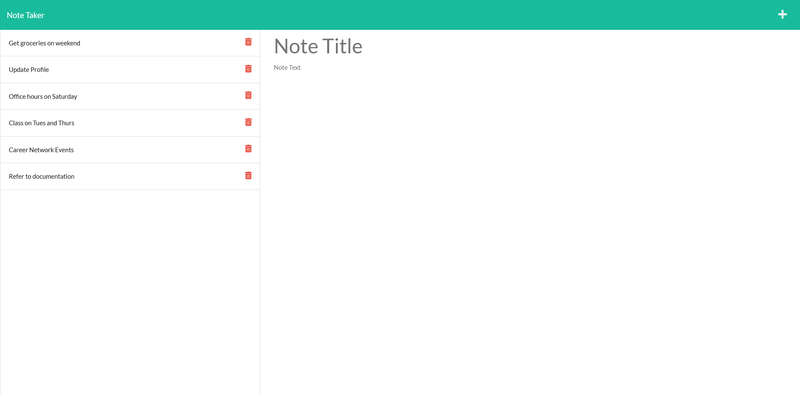

# Note Taker

## Description

For this week's challenge, I built a Note Taker application using my knowledge of JavaScript, NPM, Express.js, and Heroku. This project allows a user to easily write, save, and delete notes to keep track of tasks, thoughts, and events in a user-friendly interface deployed to Heroku. Developing the Note Taker application enabled me to explore the fundamentals of Express.js and the complexities of back-end development, such as GET and POST request and creating routes that link front-end HTML pages to back-end systems. Additional technologies include the [uuid package](https://www.npmjs.com/package/uuid) from npm to generate unique ids for each note.

## Table of Contents

* [Installation](#installation)
* [Usage](#usage)
* [License](#license)
* [Links](#links)

## Installation

- No installation is needed, simply navigate to the deployed Note Taker application on Heroku using the link at the bottom of the README

## Usage

To use this application:
- Navigate to the notes page by clicking on the 'Get Started' button on the homepage.
- Click on the text area to input a Note Title and Note Text.
- When finished, click on the save button in the upper right corner of the screen and the note will be saved in the left column.
- To view the note, click on the note title and the note's text will appear on the right column
- To add a new note, click on the plus sign in the upper right corner of the screen to clear the text area for input.
- To delete a note, click on the red trash can symbol on the right side of the note.

## License

This application is covered under the [MIT](https://opensource.org/licenses/MIT).

## Links

- [Link to GitHub repository](https://github.com/kt946/note-taker)

- [Link to deployed application on Heroku](https://stormy-garden-22141.herokuapp.com/)